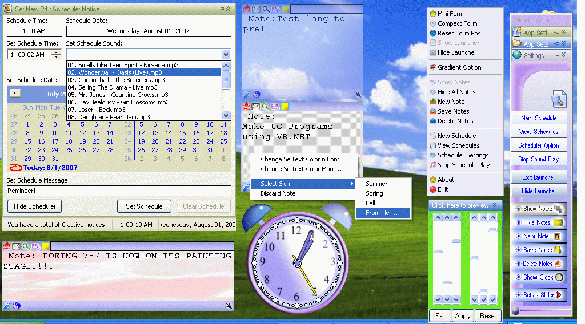



## Program Launcher V1\.0\.0 \(Complete AIO\)

### Description

Main code launch predefined programs, sticky notes to remind you of important things, a scheduler for meetings and appointments which gives due notice, an addin clock, system lock, and more.

This is my hobby, learning experience and knowledge increase on my side.

I would like to mention that i have use user controls found in this sie too like the xFrame user control, slider, kdc buttons and vktooltip from vbkeys.
 
### More Info
 

             |
---                |---
**Submitted On**   |2007-07-29 12:43:12
**By**             |[Daniel A\. Cadsawan Jr\.](https://github.com/Planet-Source-Code/PSCIndex/blob/master/ByAuthor/daniel-a-cadsawan-jr.md)
**Level**          |Beginner
**User Rating**    |5.0 (20 globes from 4 users)
**Compatibility**  |VB 5\.0, VB 6\.0
**Category**       |[Complete Applications](https://github.com/Planet-Source-Code/PSCIndex/blob/master/ByCategory/complete-applications__1-27.md)
**World**          |[Visual Basic](https://github.com/Planet-Source-Code/PSCIndex/blob/master/ByWorld/visual-basic.md)
**Archive File**   |[Program\_La2077787312007\.zip](https://github.com/Planet-Source-Code/daniel-a-cadsawan-jr-program-launcher-v1-0-0-complete-aio__1-69083/archive/master.zip)

